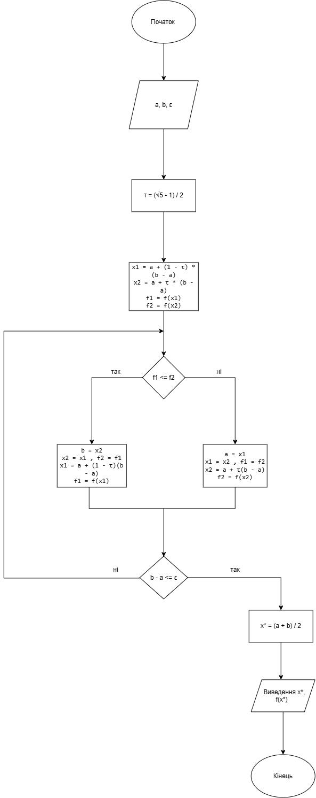
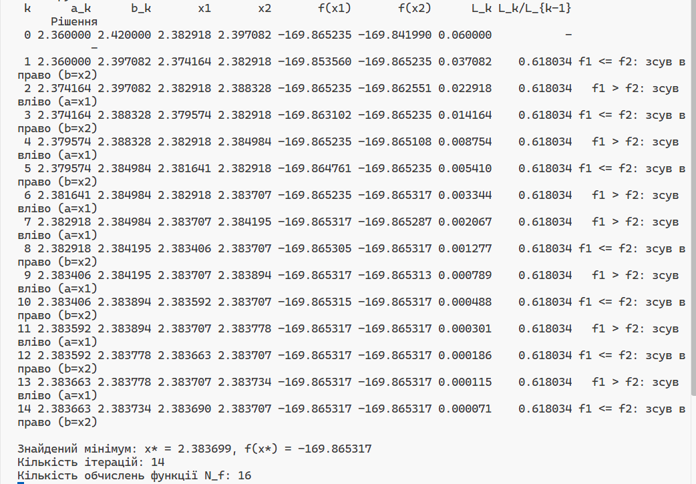
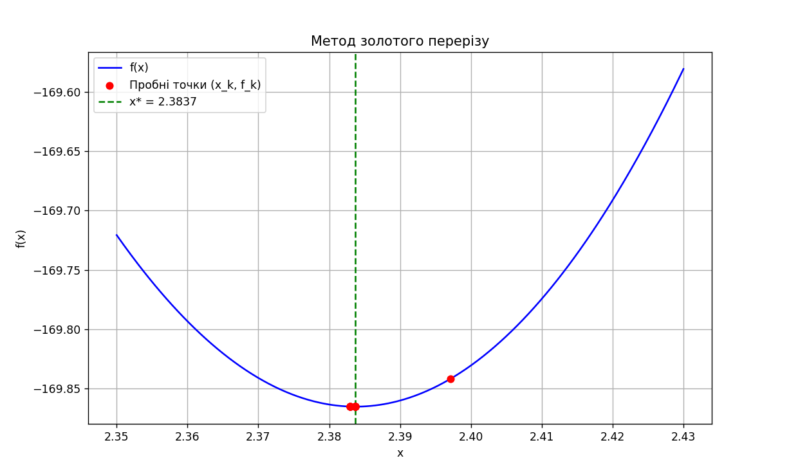

# Метод золотого перерізу

Лабораторна робота 3 містить реалізацію методу золотого перерізу для пошуку мінімуму функції однієї змінної (за варіантом 20).

## Блок-схема алгоритму 

## Результати роботи програми

### Таблиця ітерацій та пошук мінімуму

### Графік функції

## Порівняння ефективності методів

Для порівняння беремо однакову точність $\varepsilon = 10^{-4}$ та початковий інтервал $L_0 = 0.06$ (отриманий після застосування методу Свенна).

Показник ефективності $\eta$ (швидкість збіжності) визначається як відношення стискання інтервалу на одне нове обчислення функції:

$$
\eta = (\text{коефіцієнт стискання на крок})^{\frac{1}{\text{обчислень на крок}}}
$$

Чим менше значення $\eta$, тим ефективніший метод.

| Метод | Коефіцієнт стискання | Нових обчислень $f(x)$ на крок | Показник ефективності $\eta$ | Кількість обчислень $N_f$ |
|---|---|---|---|---|
| **Золотий переріз** | 0.618 | 1 (завдяки успадкуванню) | $0.618^{1} \approx \mathbf{0.618}$ | $\approx \frac{\ln(\varepsilon / L_0)}{\ln(0.618)} + 1 \approx \mathbf{15}$ |
| **Дихотомія** | 0.5 | 2 (без успадкування) | $0.5^{1/2} \approx \mathbf{0.707}$ | $2 \cdot \lceil \log_2(L_0 / \varepsilon) \rceil \approx \mathbf{20}$ |
| **Половинний поділ** | 0.5 | 1 (обчислення похідної) | $0.5^{1} = \mathbf{0.500}$ | $\lceil \log_2(L_0 / \varepsilon) \rceil \approx \mathbf{10}$ |

## Висновок

Метод золотого перерізу є ефективнішим за класичну дихотомію ($\eta = 0.618 < 0.707$). Завдяки правилу успадкування пробних точок, на кожній ітерації (окрім першої) потрібне лише одне обчислення цільової функції. Це дозволяє досягти заданої точності $\varepsilon$ за $N_f = 15$ обчислень, тоді як дихотомія потребує $20$. Метод половинного поділу теоретично найшвидший ($\eta = 0.500$), але вимагає обчислення аналітичної похідної $f'(x)$, що не завжди доцільно.