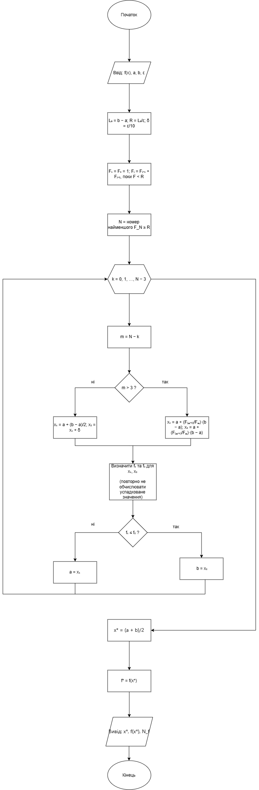
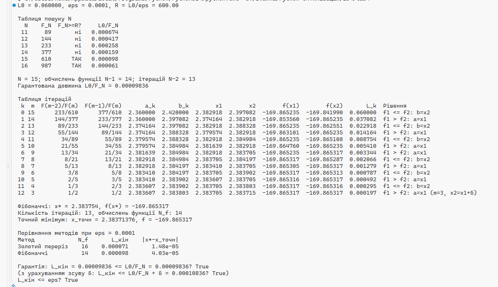

# Метод чисел Фібоначчі

Лабораторна робота 4 містить реалізацію методу чисел Фібоначчі для пошуку мінімуму функції однієї змінної (за варіантом 20)

## Блок-схема алгоритму 

## Результати роботи програми

