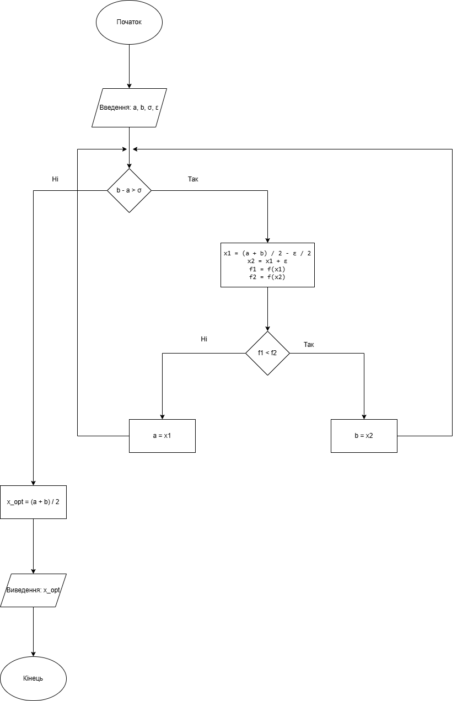
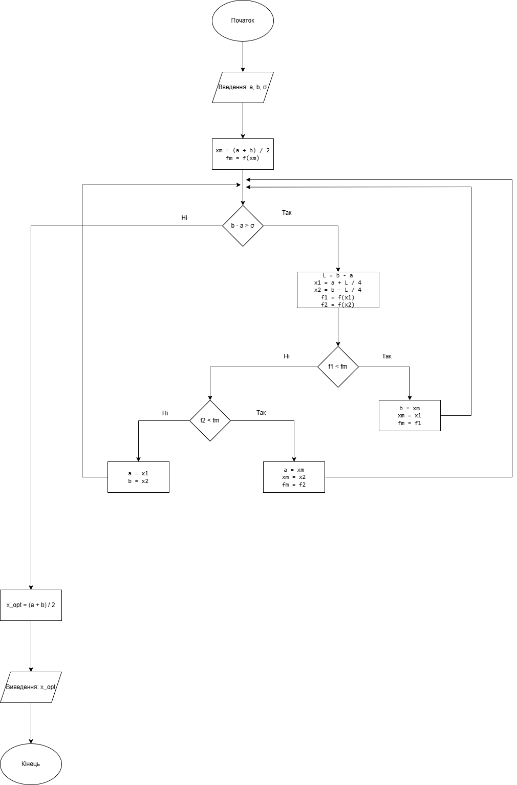
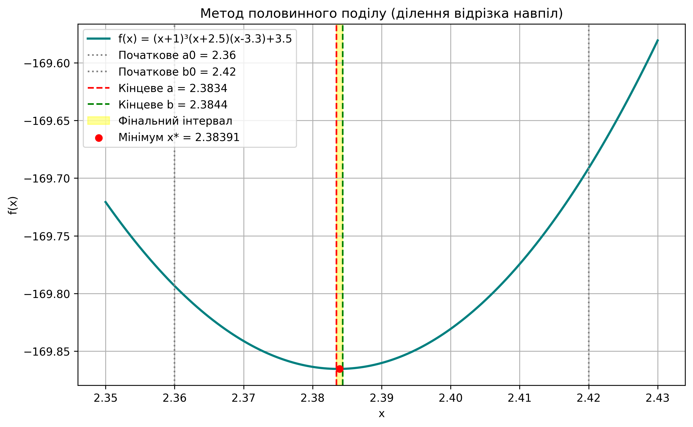

# Методи одновимірної оптимізації

Реалізація чисельних методів оптимізації для пошуку локального мінімуму функції:
$$f(x) = (x+1)^3(x+2.5)(x-3.3)+3.5$$

## Реалізовані алгоритми

1. **Метод Свенна** — знаходження початкового інтервалу невизначеності $[a, b]$, що гарантовано містить локальний мінімум.
2. **Метод дихотомії** — звуження інтервалу невизначеності з параметром зміщення $\varepsilon = 0.0001$ та точністю $\sigma = 0.001$.
3. **Метод половинного поділу (Bisection)** — звуження інтервалу шляхом його поділу на 4 рівні частини та аналізу значень у 3 внутрішніх точках.

---

## Структура репозиторію

```text
├── images/
│   ├── swann_plot.png
│   ├── swann_flow.png
│   ├── dichotomy_plot.png
│   ├── dichotomy_flow.png
│   ├── bisection_plot.png
│   └── bisection_flow.png
├── lab1_swann.py
├── lab1_dichotomy.py
├── lab1_bisection.py
├── requirements.txt
├── .gitignore
└── README.md
```
## Блок-схеми алгоритмів (ДСТУ ISO 5807:2016)

### Метод Свенна


### Метод дихотомії


### Метод половинного поділу



## Результати та візуалізація

### Метод Свенна


### Метод дихотомії


### Метод половинного поділу


---

## Порівняння ефективності методів

Початковий інтервал пошуку (отриманий методом Свенна): $[2.3600, 2.4200]$, параметри збіжності: $\varepsilon = 0.0001$, $\sigma = 0.001$.

| Метод | Кількість ітерацій | Кількість обчислень $f(x)$ | Точка мінімуму $x^*$ | Значення $f(x^*)$ |
| :--- | :---: | :---: | :---: | :---: |
| **Метод Свенна** (локалізація) | 3 | 9 | $[2.3600, 2.4200]$ | — |
| **Метод дихотомії** | 7 | 14 | 2.38368 | -169.86532 |
| **Половинний поділ (Bisection)** | 6 | 13 | 2.38391 | -169.86531 |

---

## Висновки

1. **Метод Свенна** дозволив успішно локалізувати унімодальний відрізок локального мінімуму $[2.3600, 2.4200]$ з початкової точки $x_0 = 2.35$ за 3 ітерації та 9 обчислень функції.
2. **Метод дихотомії** досяг заданої точності $\sigma = 0.001$ за 7 ітерацій, виконавши 14 обчислень функції (рівно по 2 нові точки $x_1, x_2$ на кожен крок).
3. **Метод половинного поділу** досяг результату за 6 ітерацій та 13 обчислень цільової функції. Завдяки запам'ятовуванню центральної точки $x_m$ на кожному кроці розраховувалося лише 2 нових значення замість 3.
4. **Підсумок:** метод половинного поділу продемонстрував кращу обчислювальну ефективність за методом дихотомії, скоротивши як кількість необхідних ітерацій (6 проти 7), так і загальну кількість викликів цільової функції (13 проти 14).

## Встановлення та запуск
1. Клонувати репозиторій:
```bash
git clone https://github.com/ivannaspas11/Optimisation-methods.git
cd Optimisation-methods
pip install -r requirements.txt
python lab1_swann.py
python lab1_dichotomy.py
python lab1_bisection.py
```